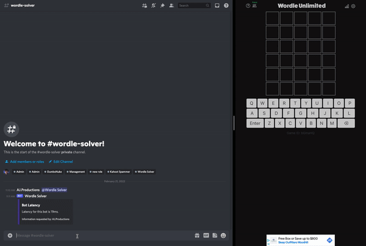

<!-- Contents -->

 

# [***Wordle Solver Discord Bot***](https://discord.gg/4Dswf8Ac9y)

# Table of Contents:

- [Notes](#notes)
- [Prerequisites](#prerequisites)
- [About](#about)
    - [*What is This?*](#what-is-this)
    - [*Why This Project?*](#why-this-project)
    - [*How does it Work?*](#how-does-it-work)
- [Functionalities](#functionalities)
- [Features](#features)
- [Commands](#commands)
- [Help](#help)
  
<!-- About -->
 

# Notes

We add new features and fix bugs periodically. Make sure you are constantly checking for the new updates that may result in better performance for the bot and the server.

# Prerequisites

It's good to have prior knowledge of Python, Discord.py library and Discord. If you don't have any idea of the three links mentioned above, then this project may be a little bit more difficult.

# About

The  ***Wordle Solver Discord Bot***  was created for individuals that have a hard time completing standard wordles. We integrated this program into discord, for ease of access. The bot is hosted online 24/7 and has a bank of over *5,000 5-letter words*.

### *What is This?*

This bot allows you to finish wordles successfully. The  ***Wordle Solver Discord Bot***  will suggest a word to use, and then will ask for your input on what the word did for you. You go back and forth while the bot narrows down the word, and you'll solve it 100% of the time. 

### *Why This Project?*

There is no actual answer for this question! We understand that a bot like this may ruin the fun for some, but it was a great journey creating this with the team. We strongly encourage that you still try to solve wordles by yourself as it increases brain functionality, but if you ever get stuck, we're here for you. That's why the  ***Wordle Solver Discord Bot***  does what it does.

### *How does it Work?*

Watch this short video on how to use the bot.

# Functionalities

The  ***Wordle Solver Discord Bot***  solves hundreds of equations every second to narrow the possibility of each word left in the word bank. Once the bot is aware of letters that no longer are present in the word, it performs these carefully written equations to remove the other words. We use a system of  ***'012'***  so that the user can enter input quickly. The bot will say  ***"Try angry."*** . Once you test this word, you then feed the bot input through the same channel.  ***0***  means that the letter is not in the word,  ***1***  means that the letter is present in the word, but in the wrong position, and  ***2***  means it is present, and it is in the right position. (Ex. 00210) Once enough words have been tested, the bot will finally say  ***"The word is apple!"*** . Just like that, you have solved the wordle. Easy, right?

# Features

- Quick Response
- Complex System
- Command Timeout
- Ease of Use
- Updated Frequently
- [Support Server](https://discord.gg/4Dswf8Ac9y)
- Efficient Team

# Commands

The prefix for the bot is ``=`` and cannot be changed on the server end. 

- **Start the Wordle Solving Program** *``=wordle``*
- **Bot Help Command** *``=help``*
- **Bot Commands List** *``=commands``*
- **Test Latency** *``=ping``*
- **View Stats** *``=stats``*
- **Request An Invite Link** *``=invite``*

# Help

For any sort of help, feel free to contact us by joining our [Discord Server](https://discord.gg/4Dswf8Ac9y). In our discord server you can talk to our team and clarify your queries through a ticket. Make sure to include detailed information and possibly a screenshot if you can. Our team will try to reach out to you as soon as possible.

# 

&copy; ***2022*** *AJ.Productions#1815*

